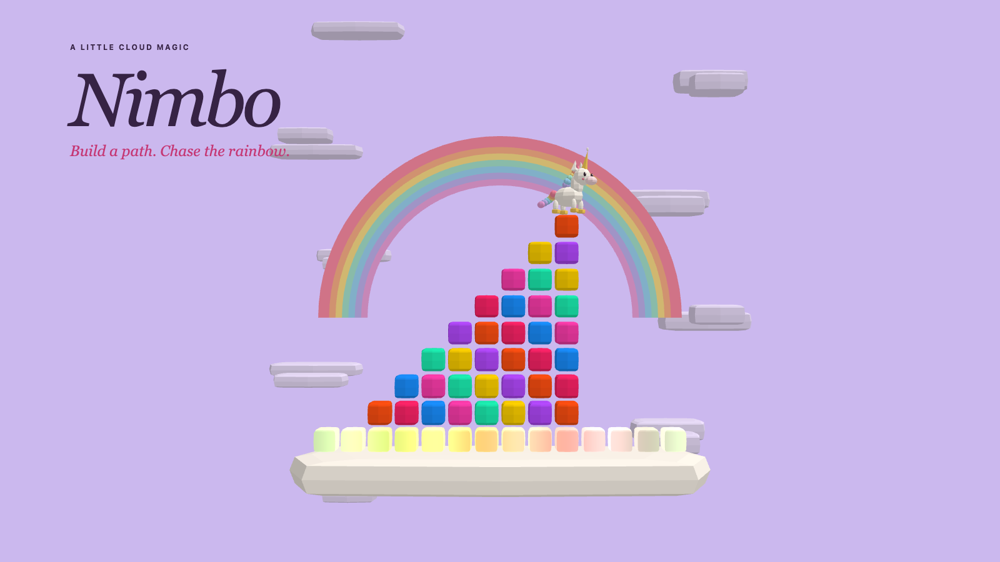

# Nimbo: a little cloud magic in 13KB

A tiny unicorn, a rising bank of fog, and a pile of clouds that can become either a staircase or a disaster. Nimbo began with a simple question: what happens when the character climbing a falling-block puzzle has a life of her own?

The player moves the pieces. Nimbo chooses her own steps. That separation creates the central tension: a good placement must fit the board and leave a route that a small unicorn can actually climb.

*Staged promotional scene rendered with the game's procedural models.*

## Finding the game again

An experiment turned the tower into a scrolling rainbow bridge with an isometric view. It made the game harder to read, and repeated hard drops could create progress without enough meaningful decisions. Player feedback was direct: the game had lost its mechanics.

The response was to return to frontal cloud stacking. A wider, 14-column board and a more distant camera gave players room to plan. Nimbo can climb up to two cells higher and one cell across, so building a reachable staircase matters more than simply piling blocks as high as possible.

## A completed row should feel like an achievement

Traditional row deletion worked against the climb: finishing a platform could remove the very surface Nimbo needed. The final design turns a full row into a permanent rainbow checkpoint platform. Completing it creates the platform; landing on it activates the checkpoint.

These platforms take priority over color matches. They stay fixed, divide the board into gravity regions, and survive checkpoint retries. Outside them, five or more consecutive clouds of one color clear horizontally or vertically. Matches highlight before disappearing, then the remaining clouds compact while gameplay and fog pause.

This gives placements two useful goals: make space through matches, or invest in a safe platform for the climb ahead.

## Making danger honest

Crushing was another important correction. A hard drop cannot simply check its final cell: it must test the whole path against Nimbo, including while she jumps. Sideways movement and rotations must also respect her body. The red landing preview warns when a drop will hit her.

Clouds moved by a clear do not crush Nimbo. If support disappears, she falls visibly rather than teleporting onto a convenient block. Retrying a checkpoint restores an independent snapshot and restarts the pending piece safely above the board. The rising fog remains a threat; a checkpoint is a second chance, not invulnerability.

## Spending bytes on personality

Nimbo's cream body, golden horn, rainbow mane and tail are procedural geometry. The same small WebGL renderer draws the clouds, landing cues, sparkles and rainbow platforms. Platform color, glow and movement come from shader math, without texture downloads. Reduced-motion preferences keep the checkpoint colors and glow while removing their animated wave.

Web Audio supplies the synthesized melody and action cues. Geometry, shaders, interface and sound all travel inside one self-contained HTML file in the ZIP. The renderer is adapted from [xem/W](https://github.com/xem/W/tree/3834c32bddc7c66fdb465fa94af07dd5d75d3f3b), released into the public domain. Development used AI assistance; the readable implementation and packaging scripts are public.

The release archive is **13,095 bytes**, leaving **217 bytes** under the 13,312-byte limit. The desired 12,800-byte target was missed, so that remaining margin is small. Presentation images and this article live outside the game archive.

## What was checked, and what remains

The release has 28 passing regression tests covering collisions, checkpoints, matching and recovery, alongside JavaScript syntax and packaging checks. Recorded verification includes Chrome 153, Firefox 155, desktop, a 390 × 844 mobile viewport and landscape. The exact unpacked ZIP also received 15 minutes 58 seconds of active play in the integrated browser. Those records do not establish physical-phone coverage or a complete OS focus-switch test.

The most useful lesson was to judge each change by what the player can understand and decide. More spectacle did not rescue an unclear rule. Restoring the readable camera, making danger visible, and turning completed rows into lasting progress did more for Nimbo than adding another effect.

This is a development post-mortem written during submission preparation. It makes no claim of organizer acceptance or competition results.

[Read the source and build instructions](https://github.com/chainsawteam-org/js13kgames2026-nimbus/tree/competition-2026) · [Release verification](README.md)
